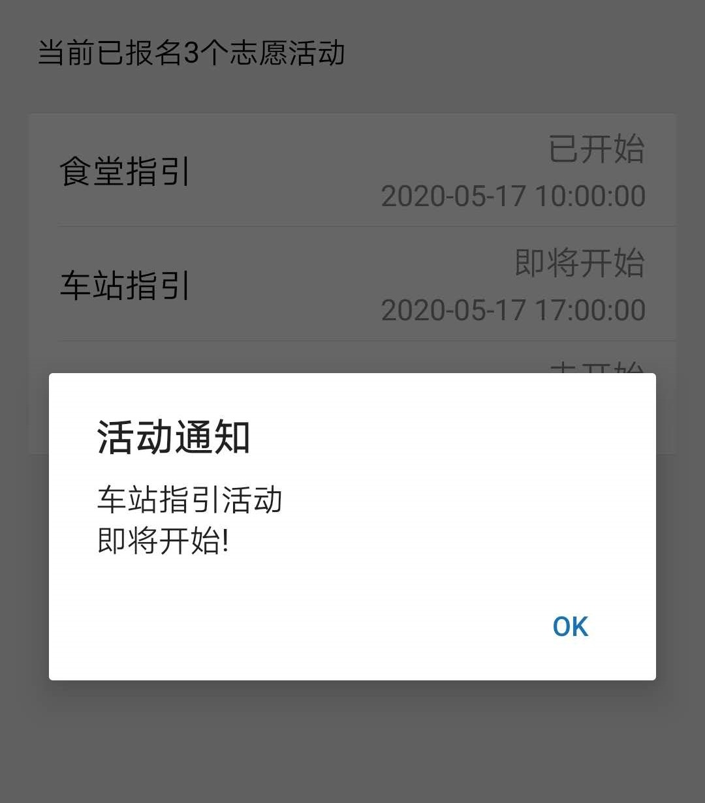

## 功能 ##
显示已报名志愿者活动列表，显示当前活动状态（未开始/即将开始/已开始）

显示已参加的志愿活动列表

展示指定的志愿活动的详细信息

每五分钟检查志愿活动，如果两小时内某志愿活动即将开始，弹出提醒并更新状态

## 说明 ##

当前未连接数据库

接口：

- var signedList=[0,4,5];//已报名活动id

- var DoneList=[1,2,3];//已参与活动id

- `Activity=[{
	id:0,
	title:"食堂指引",
	time: "2020-05-17 10:00:00",
	address:"玉泉食堂",
	type:"执勤",
	state:"未开始"
},...]//活动详细信息` 
 

## 配置 ##
- expo install react-native-gesture-handler react-native-reanimated react-native-screens react-native-safe-area-context @react-native-community/masked-view react-native-web
- expo install @react-navigation/native
- expo install @react-navigation/stack
- expo install @react-navigation/bottom-tabs
- expo install @ant-design/react-native
- app.js,DoneScreen.js,DetailScreen.js,SignedScreen.js放置于当前目录下
- expo start

## 运行结果 ##

