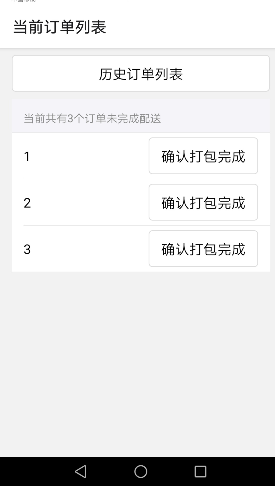
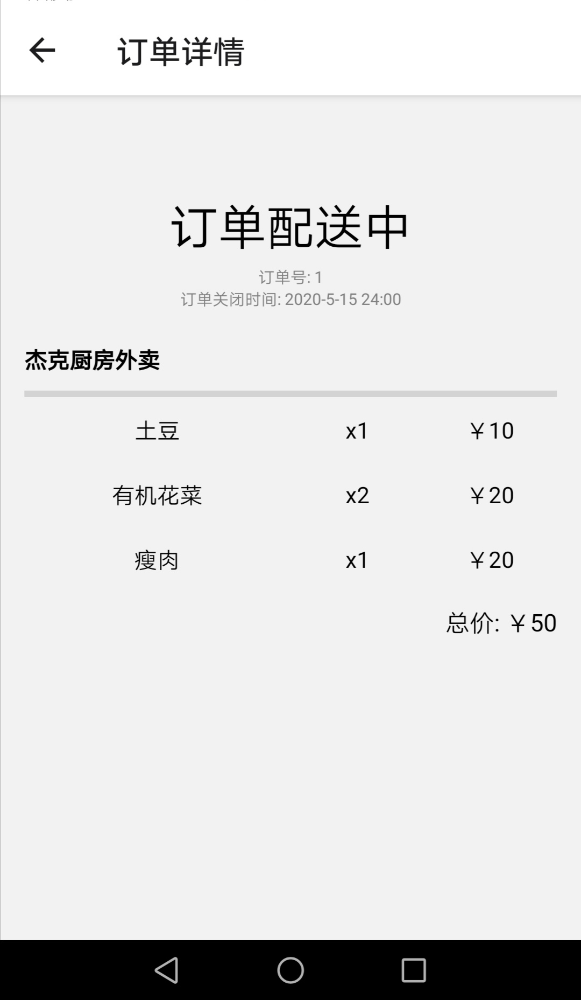

## 说明 ##
在已实现的商家订单列表中增加功能：点击某一订单后显示订单详细信息

目前暂未连接数据库，订单详情页面中的{index}为选择的订单编号，可以通过该编号查询订单信息并实例化

## 配置 ##
- expo install react-native-gesture-handler react-native-reanimated react-native-screens react-native-safe-area-context @react-native-community/masked-view
- expo install @react-navigation/native
- expo install @react-navigation/stack
- npm install @ant-design/react-native --save
- expo install react-native-table-component
- app.js,CurrentOrder.js,HistoryOrder.js,OrderDetail.js放置于当前目录下
- npm start

## 运行结果 ##

