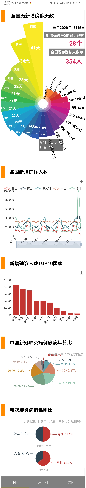

## 配置 ##
- expo install react-native-gesture-handler react-native-reanimated
- expo install react-native-tab-view
- expo install react-native-echarts-wrapper
- expo install lodash
- expo install react-native-webview
- 将sex.js,age.js,line.js,bar.js,roseChart.js，app.js放置于当前目录下
- npm start
## 运行结果 ##
